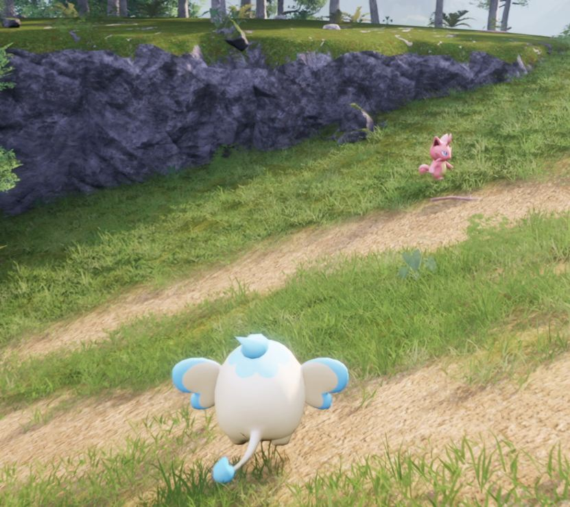
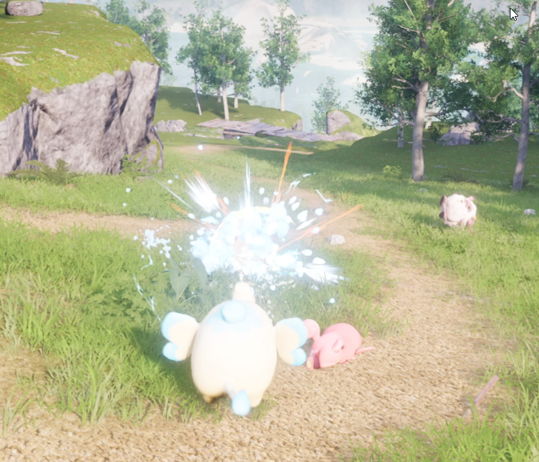
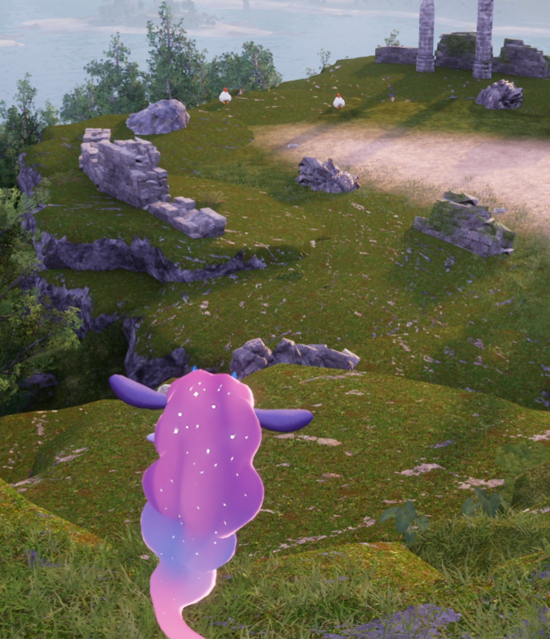
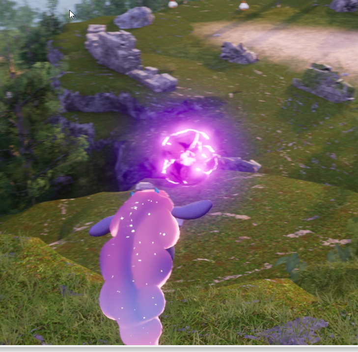
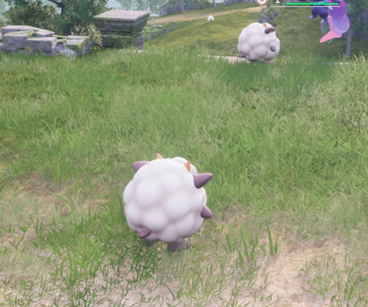
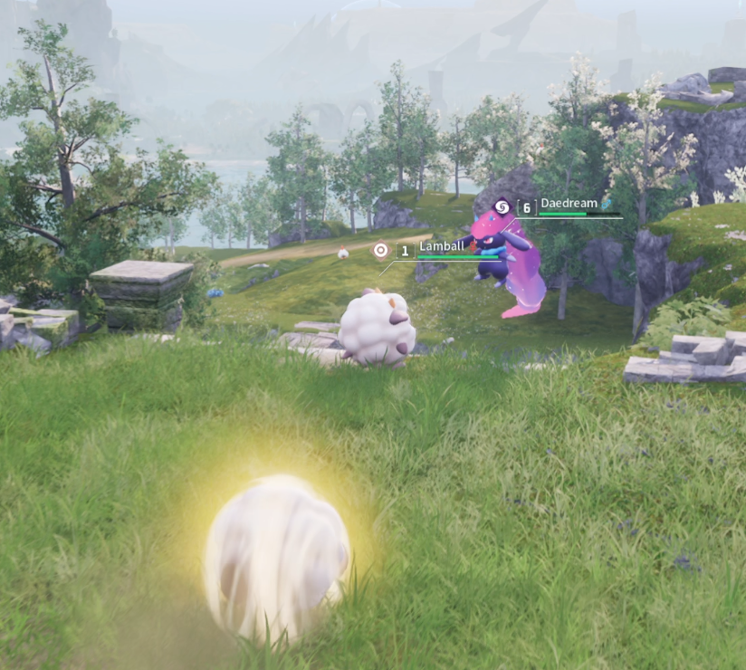

# PalwordPlayAsPal

Play as your Pal — and attack with it. Companion mod for
[PlayAsPals](https://www.nexusmods.com/palworld/mods/842): PlayAsPals lets you
possess any Pal, this mod gives the possessed Pal its bite back — left-click
(or right trigger / F7) performs the Pal's own waza (skill) on the nearest enemy.

## Requirements

- Palworld (Steam) + UE4SS ([experimental build](https://github.com/UE4SS-RE/RE-UE4SS/releases/download/experimental-latest/UE4SS_v3.0.1-1125-g527a483b.zip))
  — extract `dwmapi.dll` and the `ue4ss` folder next to `Palworld-Win64-Shipping.exe`
  in `Pal/Binaries/Win64/`, then launch the game once
- PlayAsPals LogicMod (`PlayAsPals.pak` in `Pal/Content/Paks/LogicMods/`)

## Install

1. Copy the `PalAttack` folder into `<Palworld>/Pal/Binaries/Win64/ue4ss/Mods/`
2. Enable it in `Mods/mods.txt` (add line `PalAttack : 1`) and in `Mods/mods.json`
   (add `{ "mod_name": "PalAttack", "mod_enabled": true }`)
3. Restart the game (UE4SS hot-reload is unreliable — always restart after changes)

## Use

1. Walk up to a Pal and press **`** (backtick) or **left on the controller d-pad**
   to take it over (**K** opens the camera menu, **O** the Pal panel, **F9** the control menu)
2. To turn back into the player, press **ALT** (or **right on the controller d-pad**)
3. **Left-click** — the Pal performs its waza on the nearest enemy in range
   (**F7** does the same, backup binding)
4. As a human, left-click is untouched; clicks while a menu/mouse cursor is up are ignored
5. The PlayAsPals welcome screen pops up again on world entry — PalAttack hides
   the repeat automatically (the first one at launch is left alone)

## Demo video

## Screenshots

## Troubleshooting

- Nothing happens: open `Pal/Binaries/Win64/ue4ss/UE4SS.log`, look for `[PalAttack]` lines —
  they say which step failed (no pawn, no component, no action, no enemy in 1500 units)
- Double menus / stuck UI: you have two copies of `PlayAsPals.pak` mounted
  (e.g. one in `Paks/` and one in `Paks/LogicMods/`) — keep exactly one

## Credits

Original PlayAsPals mod by the original author — we modified it so possessed Pals
can attack. Find them on Twitter [@mrrshawk](https://twitter.com/mrrshawk)
or Discord: RSHONYOUTUBE
